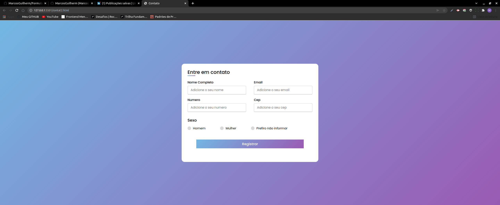
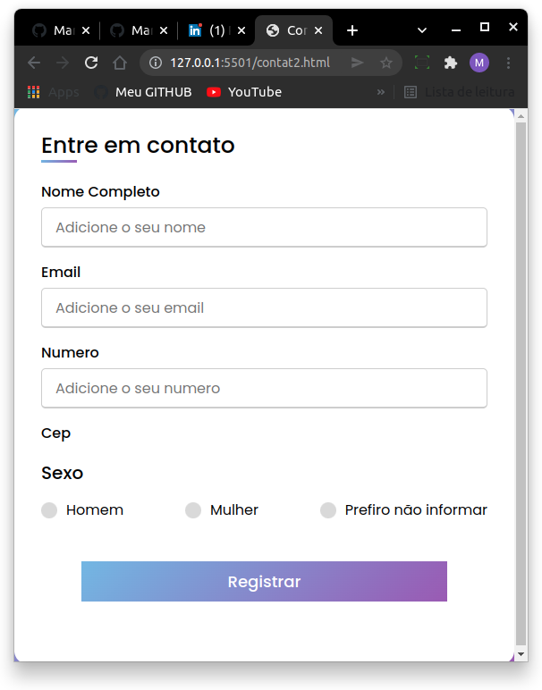

<div align="center" id="top"> 
  
  

  &#xa0;

  <!-- <a href="https://formulario.netlify.com">Demo</a> -->
</div>

<h1 align="center">Formulário</h1>

<p align="center">
  

  

  


  <!--  -->

  <!--  -->

  <!--  -->
</p>

<!-- Status -->

<!-- <h4 align="center"> 
	🚧  Formulario 🚀 Em construção...  🚧
</h4> 
<hr> -->

<p align="center">
  <a href="#dart-sobre">Sobre</a> &#xa0; | &#xa0; 
  <a href="#sparkles-funcionalidades">Funcionalidades</a> &#xa0; | &#xa0;
  <a href="#rocket-tecnologias">Tecnologias</a> &#xa0; | &#xa0;
  <a href="#white_check_mark-pré-requesitos">Pré requisitos</a> &#xa0; | &#xa0;
  <a href="#checkered_flag-começando">Começando</a> &#xa0; | &#xa0;
  <a href="https://github.com/MarcosGuilherm" target="_blank">Autor</a>
</p>

<br>

## :dart: Sobre ##

Este é um projeto simples, onde foi criado um formulário para praticar meus conhecimentos em HTML e CSS, com base no desafio proposto pela Rocketseat [Desafios - HTML](https://efficient-sloth-d85.notion.site/Desafios-HTML-ed0f6368d34d44ffab92686b9dc93229), com o desafio realizado com base no [repositório](https://github.com/MarcosGuilherm/Desafios-HTML) me desafiei a criar um fomulário melhor onde criei a sua estilização com algumas inspirações e ainda conseguir adicionar um pouco de responsividade. Para acessar a demonstração do projeto [clique aqui](https://guiurodrigues.github.io/Formulario/).

## :sparkles: Funcionalidades ##

:heavy_check_mark: Cadastro do usuário;\
:heavy_check_mark: Requisitos obrigatórios;\
:heavy_check_mark: Responsividade;

## :rocket: Tecnologias ##

As seguintes ferramentas foram usadas na construção do projeto:

- [HTML](https://developer.mozilla.org/pt-BR/docs/Web/HTML)
- [CSS](https://developer.mozilla.org/pt-BR/docs/Web/CSS)
## :white_check_mark: Pré-requisitos ##

Antes de começar :checkered_flag:, você precisa ter o [Git](https://git-scm.com)  instalado em sua maquina.

## :checkered_flag: Começando ##

```bash
# Clone este repositório
$ git clone https://github.com/MarcosGuilherm/Formulario

# Entre na pasta
$ cd Formulario

# Instale as extensão no Vscode
$ Live Server

# Para iniciar o projeto
$ Open with liver server

# O app vai inicializar em seu navegador padrão
```

&#xa0;

<a href="#top">Voltar para o topo</a>
